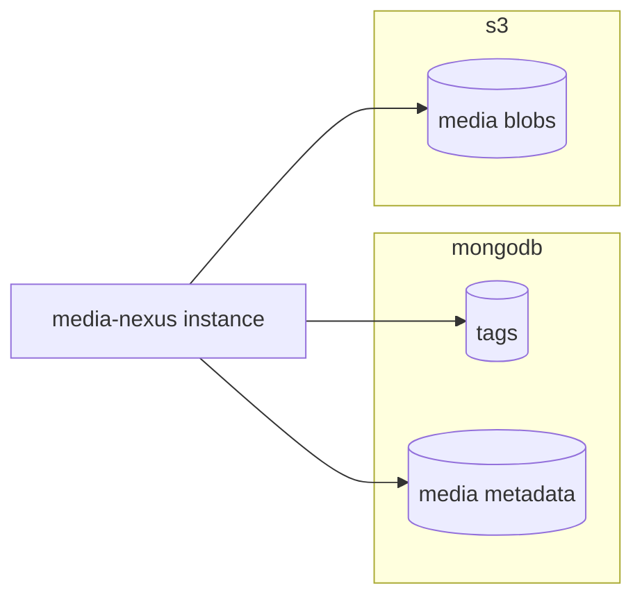
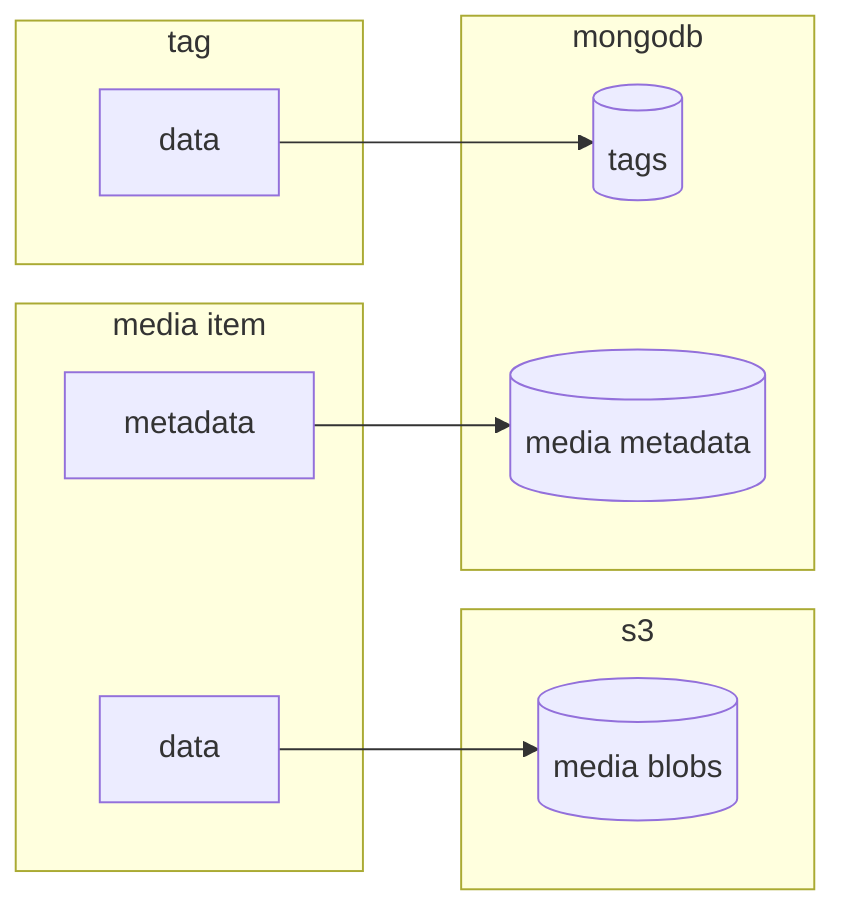

# media-nexus

## Table of Contents

* [Overview](#overview)
* [Architecture](#architecture)
* [Build and Run](#build-and-run)
* [Design Choices](#design-choices)

## Overview

media-nexus is a simple application to create media and tags through an HTTP API.

The API provides the following functionalities:

* create & list tags
  * a tag is simply a name
* create media
  * media is a tuple (name, list of tag IDs, picture)
* search media by tag IDs

### HTTP API

Run the service (cf. [Build and Run](#build-and-run)) and then navigate to `http://localhost:8081/swagger/index.html`.

## Architecture

### Services



### Model



## Build and Run

### Prerequisites

* Go
* AWS account configured that's able to manage (create, head, use) the configured media bucket
  * should be setup in `~/.aws/config` and `~/.aws/credentials`
  * or through environment variables (e.g. `AWS_ACCESS_KEY_ID` and `AWS_SECRET_ACCESS_KEY`)
* mongodb instance
* (optional) for `make lint`: `golangci-lint`

### Execution

Build it:

```bash
make deps
make compile
```

And then run it:

```bash
AWS_PROFILE=<aws profile> MEDIANEXUS_MONGODBURI=<mongo uri> ./media-nexus
```

### Documentation

```bash
make docs
```

This will regenerate the documentation. Now relaunch the service and navigate to `http://localhost:8081/swagger/index.html`.

### Integration Tests

#### Testing Prerequisites

Similar to [build and run](#build-and-run) above, you need the aws profile and mongdb URI
present in the environment. You can export it manually or do the following:

* edit `local-config.env` with your defaults
* don't forget to check the file rights now of that file (e.g. 700)
* execute `set -a && . ./local-config.env && set +a` to export them to the current shell

#### Testing itself

```bash
make test.integration
```

## Design Choices

### Architectural

As a general nice to have requirement I set AWS, because the infrastructure of the
people who gave me the task is also on AWS. And part of the task is "production-ready".

#### Hexagonal Architecture

* very well established architectural pattern for micro services
* separates well inputs, outputs, business logic

#### Media Storage

* requirements:
  * must: persistent, redundant
  * must: store blob & metadata
  * must: metadata queryable
    * contains a tag_ids metadata item, that contains a target tag ID
  * must: easily scalable
  * nice to have: public URLs for retrieving

So we want a blob storage of some sort in the cloud. Because that's persistent,
redundant and easily scalable. For more details see [Technology Choices](#technology-choices) below.

#### Multi-Database "Transactions" and Concurrency

We made the choice to store blobs in one DB and metadata for it in another. So we need to make sure we have sane state.
We achieve this by doing the following when inserting the media:

1) create the metadata with a last update time and a "upload incomplete" flag
2) upload the blob
3) clear the upload incomplete flag

When media is inserted we check whether a metadata for the file's checksum exists.
If it does, but is incomplete and a certain time has passed, we continue to re-add it.
Else we assume it must still be uploading.

Furthermore we add a partial TTL index to MongoDB to the metadata repository to remove
those docs that are incomplete and it's last update time is very long ago.

**What do we get here?**

* concurrency: we make a kind of lock through the metadata object's
  (upload incomplete, last update) tuple
* little probability of zombies in either S3 or metadata repos

#### Test Storage

We need to tell the tests where to store the data.

* option a) create new collections & buckets per whole test run
  * could be a bit crazy to create them for each run
  * besides, creation could take longer, especially when doing it often
  * also could incur additional costs (especially buckets)
* option b) have test collections & buckets
  * configure test collections & buckets
  * let the tests do cleanup
  * have monitoring on the size of these test collections & buckets

I went for option b) because it seems simpler architectural wise,
might have less overhead and might cost less.

### Technology Choices

#### S3 for Blobs

* requirements
  * must: persistent, redundant
  * nice to have: AWS
  * nice to have: multi-regional
  * nice to have: random blob metadata, that's queryable

With all that, S3 is a good choice. S3 doesn't have the metadata requirement, though.
That's why we need an additional storage for that.

#### MongoDB for Media Metadata

* requirements:
  * must: persistent, redundant
  * must: schema-less
    * you don't know the future
    * especially metadata will easily change
  * nice to have: AWS

* Schema-less: all document-based DBs
* persistent, redundant: use AWS or some other cloud
* AWS: you have DocumentDB
  * that's fully mongodb-compatible in case we don't want AWS

#### MongoDB for Tags

* requirements:
  * must: persistent, redundant
  * nice to have: AWS
  * schema-less? unsure

The choice made here is a rather pragmatic one because of the already existing idea
of using MongoDB for media metadata. We could think about using SQL here (possibly
not many schema updates, we always want to query the whole list of tags).

But since we already have MongoDB it's just a way simpler design to use MongoDB here
as well. One database less to care about with all the bells and whistles attached
you would need (costs, monitoring, ...). And most probably cheaper: one additional
collection in an existing DB vs. an additional DB.

### Library Choices

#### Swag for API documentation

* requirements:
  * must: be able to write clear, concise documentation
  * nice to have: written close to the code, not somewhere else
    * docs are always outdated, this reduces this
  * nice to have: nice UI

That's quite obvious I would say. Swagger is sooo wide spread, has so much tooling.
And with just a couple of annotations you get a really nice HTML documentation.

swag is such a tool that checks all the boxes. Actively maintained, 10k stars on github.

**So why not use OpenAPI to generate the boilerplate code for the API?**

It's not that easy. It's very opinionated and you have to work around a lot of these
opions. Or you go all-in with it and then most probably have to rewrite parts of it
when doing a major version upgrade.
Even then, there are still bugs, because it's a huge project. Then again working around
issues.

#### Logrus for Logging

* requirements:
  * must: log levels
  * must: log format
  * must: structured logging

With such a low-level tool that's spread to really all the code we must expect it will
change and alternatives will come. We choose one and put it behind a facade.

I used Logrus before, it has almost 27k stars on github. Of course there are many
alternatives out there. Logrus started to go into maintenance-only mode. So we could
have chosen another one here to be honest. But so it's good to have it behind a facade.

#### Viper for Configuration

* requirements:
  * must: config defined in code
  * must: define defaults
  * must: env vars
  * must: config file

Viper has almost 27k stars on github, is actively maintained and checks all the boxes.

### Next Steps

* discuss incomplete metadata lifetime
  * that's the time that needs to pass before retrying
  * so should be quite short
  * but so probably different for a picture and a e.g. video
  * right now: task is for pictures, so quite short
* discuss: what should be valid characters for tag & media name?
  * then validate them as well
* deadlines on request contexts
* paging on
  * list of tags
  * list of found media items
* more endpoints
  * query media by name
  * delete media
  * delete tags
  * update media (different name, different tags)
* proper cache headers
  * no cache headers right now, but definitely need that
* metrics
  * depends a bit on the environment
  * inside a service mesh: get many metrics already for free
  * with or without need to implement some metrics API connection (prometheus, datadog)
* traces
  * need to propagate downstream trace headers to upstream request
  * and need to implement solution (based on opentelemetry!?) for starting own traces
* proper CI integration
  * building, testing, packaging
