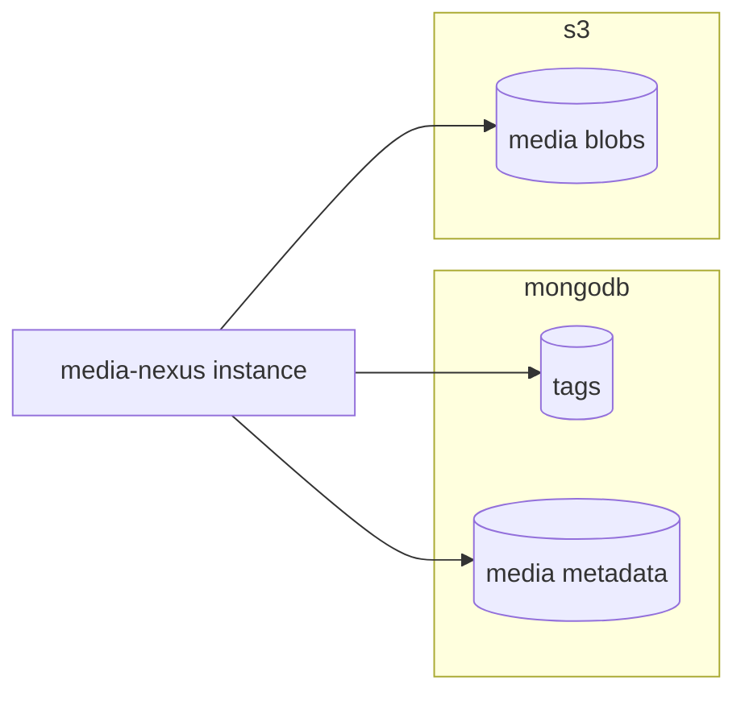

# media-nexus

## TODO

* cleanup job for metadata zombies

## Overview

media-nexus is a simple application to create media and tags through an HTTP API.

The API provides the following functionalities:

* create & list tags
  * a tag is simply a name
* create media
  * media is a tuple (name, list of tag IDs, picture)
* search media by tag IDs

## Architecture



## API Documentation

Run the service (cf. [Build and Run](#build-and-run)) and then navigate to `http://localhost:8081/swagger`.

## Build and Run

### Prerequisites

* AWS account configured that's able to manage (create, head, use) the configured media bucket
  * should be setup in `~/.aws/config` and `~/.aws/credentials`
  * or through environment variables (e.g. `AWS_ACCESS_KEY_ID` and `AWS_SECRET_ACCESS_KEY`)
* mongodb instance
* (optional) for `make lint`: `golangci-lint`

### Configuration

The configuration file is located at `local-config.yml`.

### Execution

Build it:

```bash
make deps
make compile
```

And then run it:

```bash
AWS_PROFILE=<aws profile> MEDIANEXUS_MONGODBURI=<mongo uri> ./media-nexus local-config.yml
```

### Documentation

Run:

```bash
make docs
```

This will regenerate the documentation. Now relaunch the service and navigate to `http://localhost:8081/swagger`.

## Next steps

* decide: handling of multiple metadatas of same file checksum? design decision needed

* deadlines on request contexts
* validate tag ids on create media
* proper API: e.g. openAPI
* paging on
  * list of tags
  * list of found media items
* more endpoints
* proper cache headers
* metrics & traces
